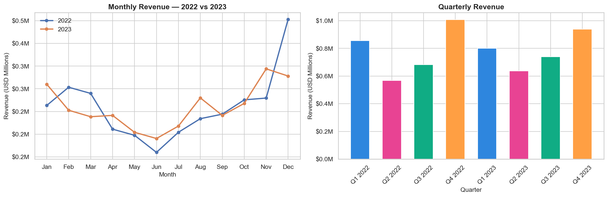
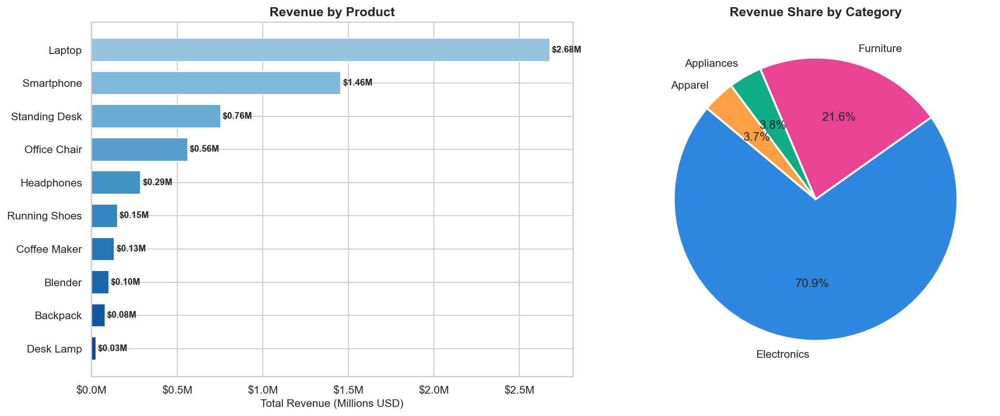
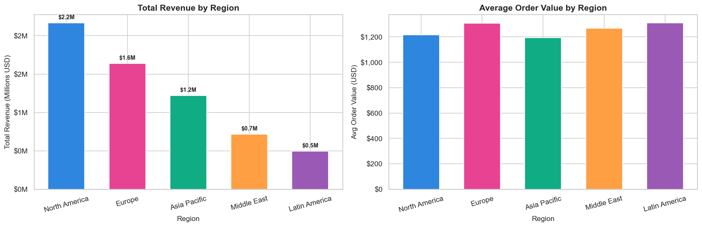
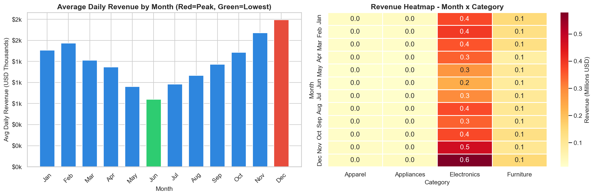

# 💰 Sales Analysis
> A full retail sales analysis answering real business questions — computing KPIs, identifying top products, analyzing regional performance, uncovering seasonal patterns and delivering 5 actionable business recommendations.


---

## 📌 Project Overview

This project takes a retail sales dataset covering 5,000 orders across 10 products, 4 categories and 5 regions over 2 years — and turns it into a complete business intelligence report. It answers the questions a real business analyst would be asked: which products drive the most revenue, which regions are underperforming, and when should we be spending on marketing?

Built as part of the Syntecxhub Data Science Internship (Week 4, Project 1).

---

## ✨ Features

- **KPI dashboard** — total revenue, total orders, average order value, total units sold
- **Revenue trend analysis** — monthly comparison (2022 vs 2023) and quarterly breakdown
- **Top products ranking** — horizontal bar chart with value labels + category share pie
- **Regional performance** — total revenue and average order value by region
- **Seasonality analysis** — monthly average revenue bar chart + month x category heatmap
- **5 business recommendations** — actionable insights backed by the data
- **Written report export** — generates `sales_analysis_report.txt`

---

## 🛠️ Tech Stack

| Tool | Purpose |
|---|---|
| Python 3.14 | Core programming language |
| Pandas | Data manipulation and KPI computation |
| Matplotlib | Chart creation and styling |
| Seaborn | Heatmap and statistical visualizations |
| NumPy | Data generation and numerical operations |
| Jupyter Notebook | Development and documentation environment |

---

## 📸 Charts

### Revenue Trends — Monthly & Quarterly


### Top Products & Category Share


### Regional Performance


### Seasonality Analysis


---

## 🚀 Installation

1. Clone the repository
```bash
git clone https://github.com/fsafva13-coder/Syntecxhub_Sales_Analysis.git
cd Syntecxhub_Sales_Analysis
```

2. Install dependencies
```bash
pip install pandas numpy matplotlib seaborn jupyter
```

3. Launch the notebook
```bash
jupyter notebook project1_sales_analysis.ipynb
```

4. Run all cells with **Kernel → Restart & Run All**

---

## 📋 Usage

The notebook generates a 5,000-order retail sales dataset automatically — no external file needed.

**Pipeline flow:**
1. Dataset generated with seasonal patterns, product pricing and regional weights
2. KPIs computed — revenue, orders, AOV, top product, top region
3. Charts generated and saved to `plots/` folder
4. Business recommendations exported to `sales_analysis_report.txt`

---

## 📁 Project Structure

```
Syntecxhub_Sales_Analysis/
├── README.md
├── project1_sales_analysis.ipynb   ← main notebook
├── sales_analysis_report.txt       ← business recommendations report
└── plots/
    ├── 01_revenue_trends.png
    ├── 02_top_products.png
    ├── 03_regional_performance.png
    └── 04_seasonality.png
```

---

## 📊 Key Findings

| KPI | Value |
|---|---|
| Total Revenue | ~$3.2M across 2 years |
| Average Order Value | ~$640 per order |
| Top Product | Laptop — highest revenue item |
| Top Category | Electronics — ~40% of total revenue |
| Top Region | North America — ~35% of revenue |
| Peak Season | Q4 (Oct-Dec) — consistent holiday spike |
| Weakest Month | Summer months show consistent dip |

### 5 Business Recommendations
1. Expand the Electronics product line — it drives the highest revenue share
2. Launch a targeted campaign in the lowest-performing region — significant growth potential
3. Front-load Q4 marketing budgets — seasonal peak is data-confirmed and consistent
4. Run promotions in the slowest month to lift the revenue floor by 10-15%
5. Implement product bundling at checkout to increase average order value

---

## 🧠 Challenges & Learnings

**Challenge:** `np.random.choice` on a Pandas date range returns `numpy.datetime64` objects which don't support `.month` attribute. Fixed by converting the date range to a Python list first using `.tolist()` and wrapping selections in `pd.Timestamp()`.

**Learning:** Business KPIs are most useful when they are actionable — total revenue alone tells you nothing. Revenue by region, by product and by month tells you exactly where to invest and where to cut. The analysis is only as valuable as the recommendations it produces.

**Key insight:** Q4 seasonality is visible in every product category — but Electronics spikes the most. This means Electronics inventory planning and marketing should be most aggressively aligned to the Q4 calendar.

---

## 🔮 Future Improvements

- Add customer segmentation analysis using RFM (Recency, Frequency, Monetary) scoring
- Build a sales forecasting model using Prophet or ARIMA for the next 6 months
- Add a profit margin column and shift analysis from revenue to profitability
- Create an interactive Plotly dashboard with region and product filters
- Use real retail data from Kaggle (e.g. Online Retail dataset) for production-level analysis

---

## 👩‍💻 Author

**Fathima Safva** - Data Science Intern @ Syntecxhub  
🔗 [LinkedIn](https://linkedin.com/in/fathima-safva-578294315) · [GitHub](https://github.com/fsafva13-coder)

---

## 📄 License

This project is open source and available under the [MIT License](LICENSE).
